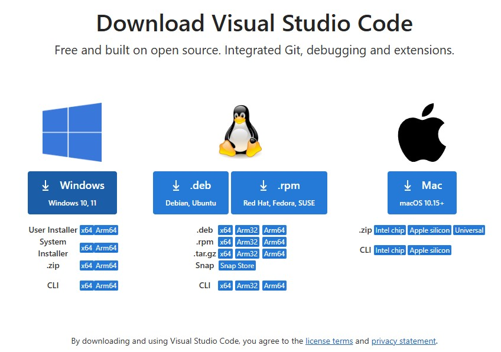
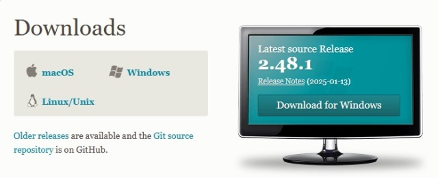
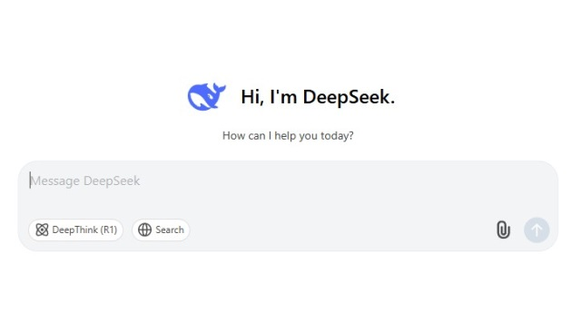
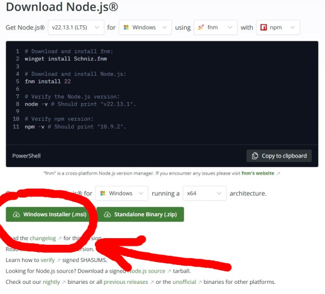

# Javascript tutorial

Практическое занятие - подготовка рабочего окружения. 

## Установка VS code и регистрация на github. 
Скачайте и установите последнюю версию VsCode по ссылке https://code.visualstudio.com/download. 

  

Если у вас еще нет аккаунта GitHub, зарегистрируйтесь по ссылке https://github.com/  
Так же как и vscode, на локальную машину нужно будет установить git из официального источника  https://git-scm.com/downloads  

  

Если у вас нет большого опыта в разработке веб-приложений, то очень пригодится ИИ помощник. 
Можно использовать https://www.deepseek.com/ или https://www.chatgpt.com/ если используете ВПН. 

  


## Client side 

### 1. Создайте простую страницу `index.html`. 
Наполните ее содержимое  

```html
<!DOCTYPE html>
<html lang="ru">
<head>
    <meta charset="UTF-8">
    <meta name="viewport" content="width=device-width, initial-scale=1.0">
    <title>Моя первая веб-страница</title>
</head>
<body>
    <h1>Добро пожаловать на мою веб-страницу!</h1>
    <p>Это пример простой веб-страницы, созданной с использованием HTML и CSS.</p>
    <p>Вы можете узнать больше о веб-разработке, посетив <a href="https://developer.mozilla.org/ru/docs/Web/HTML" target="_blank">документацию MDN</a>.</p>
</body>
</html>
```

### 2. Запустите live server расширение и посмотрите на страницу в браузере.


### 3. Создайте файл с определением стилей `styles.css` и наполните содержимое.  

```css
body {
    font-family: Arial, sans-serif;
    background-color: #f0f0f0;
    margin: 0;
    padding: 0;
    display: flex;
    justify-content: center;
    align-items: center;
    height: 100vh;
    flex-direction: column;
}
h1 {
    color: #333;
}
p {
    color: #666;
}
a {
    color: #007BFF;
    text-decoration: none;
}
a:hover {
    text-decoration: underline;
}
```

### 4. Добавьте кнопку с вызовом метода `alert("Hello js!")`

```js 
<button onclick="showAlert()">Нажми меня!</button>

<script>
    function showAlert() {
        alert("Hello js!");
    }
</script>
```

### 5. Добавьте кнопку, которая при нажатии будет изменять цвет фона случайным образом. 

### 6. Добавьте форму ввода данных. 

### 7. Добавьте функцию для отправки данных с помощю fetch api. 


## Server side

### 1. Установка node.js 

**Node.js** — это среда выполнения JavaScript кода, которая  работает на движке V8 (тот же движок, что и в Google Chrome). 
Изначально JavaScript использовался только в браузерах для создания интерактивных веб-страниц.  
Однако с появлением Node.js разработчики получили возможность писать на JavaScript серверный код, утилиты, инструменты и даже настольные приложения.  

Установите node.js с официального сайта https://nodejs.org/en/download  

  

**npm** (Node Package Manager) — это менеджер пакетов для Node.js, который упрощает установку, управление и использование сторонних библиотек в проекте. 
Разработчики всего мира уже создали множество полезных библиотек и инструментов. 
Чтобы мы могли их использовать, этот готовый js-код уже опубликован в репозитории npm и доступен для установки.  
Например, чтобы создать новый проект, нам не нужно вручную создавать основные шаблонные файлы. 
Достаточно установить пакет `create-react-app`  

```sh
npm install create-react-app
```

### 2. Создание проекта на react  

```sh
npx create-react-app my-app
cd my-app
npm start
```
