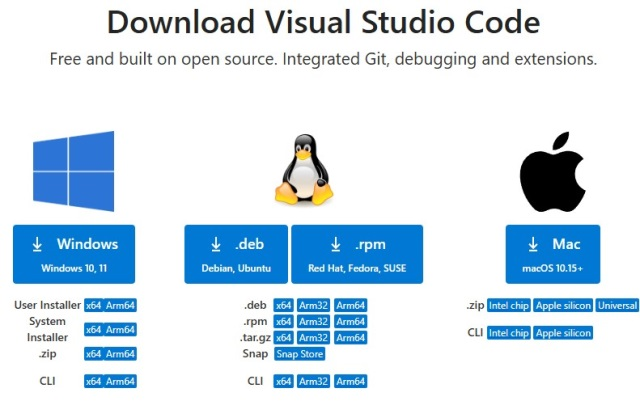

# Javascript tutorial

Практическое занятие - подготовка рабочего окружения. 

## Установка VS code и регистрация на github. 
Скачайте и установите последнюю версию VsCode по ссылке https://code.visualstudio.com/download. 

  

Если у вас еще нет аккаунта GitHub, зарегистрируйтесь по ссылке https://github.com/  
Так же как и vscode, на локальную машину нужно будет установить git из официального источника  https://git-scm.com/downloads  

  

Если у вас нет большого опыта в разработке веб-приложений, то очень пригодится ИИ помощник. 
Можно использовать https://www.deepseek.com/ или https://www.chatgpt.com/ если используете ВПН. 

  

## Client side 

1. Создать простую страницу `index.html`, запустить через live server расширение
2. Создать файл с определением стилей `styles.css`
3. Добавить кнопку с вызовом метода `alert("Hello js!")`
4. Добавить кнопку со случайным изменением цвета фона. 
5. Добавить форму ввода данных. 
6. Добавить функцию для отправки данных с помощю fetch api. 

## Server side

1. Установка node.js 
2. Создание проекта на react. 
 